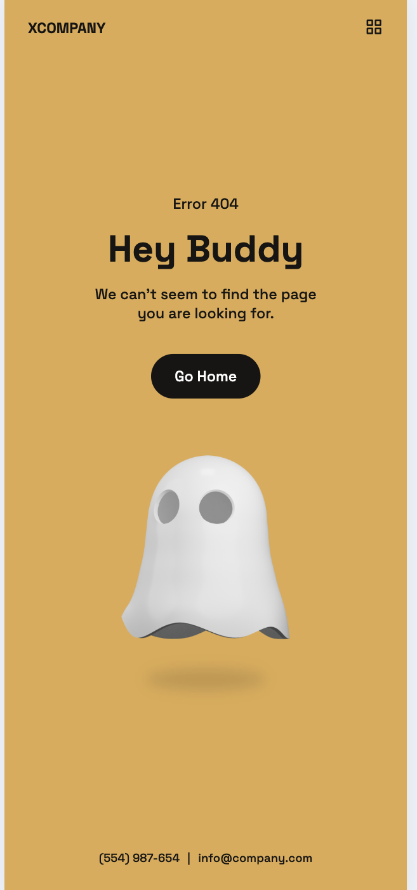
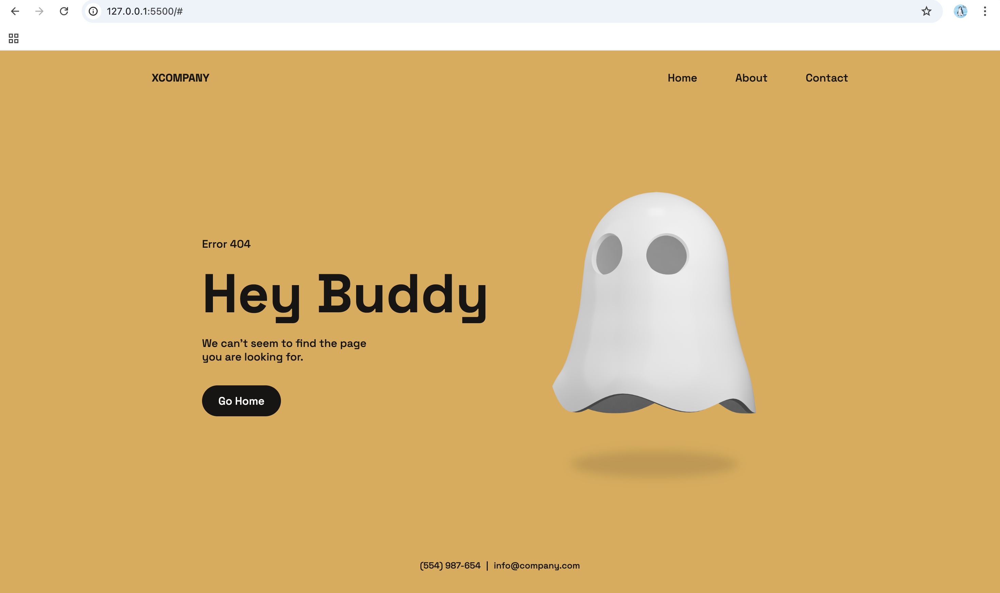

# 404 Error Page - XCOMPANY 🚀

A modern, responsive 404 error page designed for **XCOMPANY**. This page ensures a smooth user experience when navigating to a non-existent route, with a clean and animated interface.

## 🔗 Live Demo
👉 [View the 404 Page](https://jolly-cactus-1921a8.netlify.app)

## 📸 Page Previews
### 📱 Mobile View
 

### 💻 Desktop View
 *(Replace with actual image link)*

## ✨ Features
- Fully responsive design
- Smooth animations
- Simple and modern UI
- Optimized for fast loading
- Accessible and user-friendly

## 🛠️ Technologies Used
- **HTML5**
- **CSS3**
- **JavaScript (ES6+)**
- **ScrollReveal.js (for animations)**

